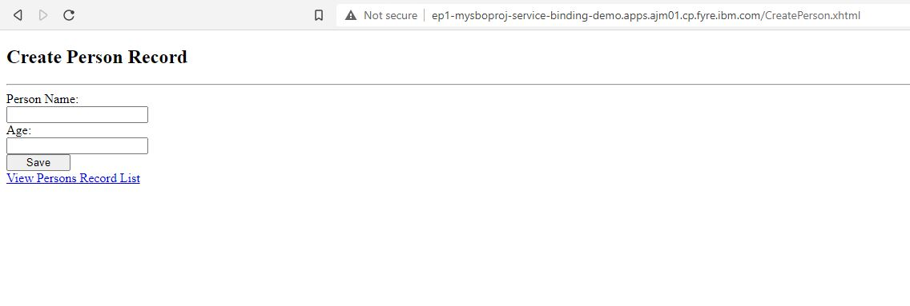

# Binding a Java Microservices JPA app to an In-cluster Operator Managed PostgreSQL Database on minikube

## Introduction

This scenario illustrates binding an odo managed Java MicroServices JPA application to an in-cluster Operater managed PostgreSQL Database in the minikube environment.

## What is odo?

odo is a CLI tool for creating applications on OpenShift and Kubernetes. odo allows developers to concentrate on creating applications without the need to administer a cluster itself. Creating deployment configurations, build configurations, service routes and other OpenShift or Kubernetes elements are all automated by odo.

## Installation and Configuration of the minikube environment
<b>Please Note:</b> The guide only works with minikube configured with kubernetes 1.19.x or lower. odo link cannot link services successfully in a Kubernetes 1.20.x or higher environment as of this writing.

It is recommended tothat users of this guide obtain a suitable system for running minikube with kubernetes. In practice this should be a 4 core system minimum. Before proceeding to the sample application, please follow the instructions for establishing a minikube environment:

### Install and start docker 
Please follow instructions [here](https://docs.docker.com/engine/install/) for your OS distribution.

### Install and start and configure minikube

#### <u>Install minikube</u>
Follow minikube installation instructions [here](https://minikube.sigs.k8s.io/docs/start/) for your operating system target.

#### <u>Start minikube</u>
If running as root, minikube will complain that docker should not be run as root as a matter of practice and will abort start up. To proceed, minikube will need to be started in a manner which will override this protection:
```shell
> minikube start --force --driver=docker --kubernetes-version=v1.19.8
```

If you are a non-root user, start minikube as normal (will utilize docker by default):
```shell
> minikube start --kubernetes-version=v1.19.8
```

#### <u>Configure minikube</u>
ingress config:<br>
The application requires an ingress addon to allow for routes to be created easily. Configure minikube for ingress by adding ingress as a minikube addon:
```shell
> minikube addons enable ingress
```
Note: It is possible that you may face the dockerhub pull rate limit if you do not have a pull secret for your personal free docker hub account in place. During ingress initialization two of the job pods used by ingress may fail to initialize due to pull rate limits. If this happens, and ingress fails to enable, you will have to add a secret for the pulls for the following service accounts:

- ingress-nginx-admission
- ingress-nginx

to add a pull secret for these service accounts: <br>
- switch to the kube-system context:
```shell
> kubectl config set-context --current --namespace=kube-system
```
- create a pull secret:
```shell
> kubectl create secret docker-registry regcred --docker-server=<your-registry-server> --docker-username=<your-name> --docker-password=<your-pword> --docker-email=<your-email>
```
~~~
        where:
          - <your-registry-server> is the DockerHub Registry FQDN. (https://index.docker.io/v1/)
          - <your-name> is your Docker username.
          - <your-pword> is your Docker password.
          - <your-email> is your Docker email.
~~~

- add this new cred ('regcred' in the example above) to the default service account in minikube:
```shell
> kubectl patch serviceaccount ingress-nginx-admission -p '{"imagePullSecrets": [{"name": "regcred"}]}'
> kubectl patch serviceaccount ingress-nginx -p '{"imagePullSecrets": [{"name": "regcred"}]}'
```

 Default Service Account Pull Secret patch:<br>
 Much like the ingress service accounts, the default service account will need to be patched with a pull secret configured for your personal docker account. 

 - switch to th edefault context:
 ```shell
 > kubectl config set-context --current --namespace=default
```

 - create the same docker-registry secret configured for your docker , now for the default minikube context:
 ```shell
 > kubectl create secret docker-registry regcred --docker-server=<your-registry-server> --docker-username=<your-name> --docker-password=<your-pword> --docker-email=<your-email>
 ```


~~~
        where:
          - <your-registry-server> is the DockerHub Registry FQDN. (https://index.docker.io/v1/)
          - <your-name> is your Docker username.
          - <your-pword> is your Docker password.
          - <your-email> is your Docker email.
~~~

- Add this new cred ('regcred' in the example above) to the default service account in minikube:
```shell
> kubectl patch serviceaccount default -p '{"imagePullSecrets": [{"name": "regcred"}]}'
```
Kubernetes Dashboard graphical UI config:<br>
 It is helpful to make use of the basic kubernetes dashboard UI to interact with the various kubernetes entities in a graphical way. Please refer to the directions [here](https://minikube.sigs.k8s.io/docs/handbook/dashboard/) for enabling and starting the dashboard. Please note, this require the installation of and access to a desktop environment in order to make use of the dashboard. (GNOME + xrdb for example)

Operator Lifecycle Manager (OLM) config:
Enabling OLM on your minikube instance simplifies installation and upgrades of Operators available from [OperatorHub](https://operatorhub.io). Enable OLM with below command:
```shell
> minikube addons enable olm
```

### Install odo
Please follow odo installation instructions [here](https://odo.dev/docs/installing-odo/) for your OS distribution.

## Actions to Perform by Users in 2 Roles

In this example there are 2 roles:

* Cluster Admin - Installs the Operators to the cluster
* Application Developer - Imports a Java MicroServices JPA application, creates a DB instance, creates a request to bind the application and DB (to connect the DB and the application).

### Cluster Admin

The cluster admin needs to install 2 Operators into the cluster:

* Service Binding Operator
* A Backing Service Operator

A Backing Service Operator that is "bind-able," in other
words a Backing Service Operator that exposes binding information in secrets, config maps, status, and/or spec
attributes. The Backing Service Operator may represent a database or other services required by
applications. We'll use Dev4Devs PostgreSQL Operator found in the OperatorHub to
demonstrate a sample use case.

#### Install the Service Binding Operator

Below `kubectl` command will make the Service Binding Operator available in all namespaces on your minikube:
```shell
> kubectl create -f https://operatorhub.io/install/service-binding-operator.yaml
```
#### Install the DB operator

Below `kubectl` command will make the PostgreSQL Operator available in `my-postgresql-operator-dev4devs-com` namespace of your minikube cluster:
```shell
> kubectl create -f https://operatorhub.io/install/postgresql-operator-dev4devs-com.yaml
```
**NOTE**: This Operator will be installed in the "my-postgresql-operator-dev4devs-com" namespace and will be usable from this namespace only.

#### <i>Create a database to be used by the sample application</i>
Since the PostgreSQL Operator we installed in above step is available only in `my-postgresql-operator-dev4devs-com` namespace, let's first make sure that odo uses this namespace to perform any tasks:
```shell
> odo project set my-postgresql-operator-dev4devs-com
```

We can use the default configurations of the PostgreSQL Operator to start a Postgres database from it. But since our app uses few specific configuration values, lets make sure they are properly populated in the databse service we start.

First, store the YAML of the service in a file:
```shell
> odo service create postgresql-operator.v0.1.1/Database --dry-run > db.yaml
```
Now, in the `db.yaml` file, modify and add following values under `metadata:` section:
```yaml
  name: sampledatabase
  annotations:
    service.binding/db.name: 'path={.spec.databaseName}'
    service.binding/db.password: 'path={.spec.databasePassword}'
    service.binding/db.user: 'path={.spec.databaseUser}'
```
Above configuration ensures that when a database service is started using this file, appropriate annotations are added to it. Annotations help the Service Binding Operator in injecting those values into our application. Hence, above configuration will help Service Binding Operator inject the values for `databaseName`, `databasePassword` and `databaseUser` into our application.

Also, modify the following values (these values already exist, we simply need to change them) under `spec:` section of the YAML file:
```yaml
  databaseName: "sampledb"
  databasePassword: "samplepwd"
  databaseUser: "sampleuser"
```

Now, using odo, create the database from above YAML file:
```shell
> odo service create --from-file db.yaml
```
This action will create a database instance pod in the `my-postgresql-operator-dev4devs-com` namespace. The application will be configured to use this database.

### Application Developer

#### Import the demo Java MicroService JPA application

In this example we will use odo to manage a sample [Java MicroServices JPA application](https://github.com/OpenLiberty/application-stack-samples.git).

Clone the sample app repo to your system:
```shell
> git clone https://github.com/OpenLiberty/application-stack-samples.git
```
`cd` to the sample JPA app
```shell
> cd ./application-stack-samples/jpa
```
initialize project using odo
```shell
> odo create java-openliberty mysboproj
```

Perform an initial odo push of the app to the cluster
```shell
> odo push 
```

The application is now deployed to the cluster - you can view the status of the cluster and the application test results by streaming the openshift logs to the terminal

```shell
> odo log
```
Notice the failing tests due to an UnknownDatabaseHostException:

```shell
[INFO] [err] java.net.UnknownHostException: ${DATABASE_CLUSTERIP}
[INFO] [err]    at java.base/java.net.AbstractPlainSocketImpl.connect(AbstractPlainSocketImpl.java:220)
[INFO] [err]    at java.base/java.net.SocksSocketImpl.connect(SocksSocketImpl.java:403)
[INFO] [err]    at java.base/java.net.Socket.connect(Socket.java:609)
[INFO] [err]    at org.postgresql.core.PGStream.<init>(PGStream.java:68)
[INFO] [err]    at org.postgresql.core.v3.ConnectionFactoryImpl.openConnectionImpl(ConnectionFactoryImpl.java:144)
[INFO] [err]    ... 86 more
[ERROR] Tests run: 2, Failures: 1, Errors: 1, Skipped: 0, Time elapsed: 0.706 s <<< FAILURE! - in org.example.app.it.DatabaseIT
[ERROR] testGetAllPeople  Time elapsed: 0.33 s  <<< FAILURE!
org.opentest4j.AssertionFailedError: Expected at least 2 people to be registered, but there were only: [] ==> expected: <true> but was: <false>
        at org.example.app.it.DatabaseIT.testGetAllPeople(DatabaseIT.java:57)

[ERROR] testGetPerson  Time elapsed: 0.047 s  <<< ERROR!
java.lang.NullPointerException
        at org.example.app.it.DatabaseIT.testGetPerson(DatabaseIT.java:41)

[INFO]
[INFO] Results:
[INFO]
[ERROR] Failures:
[ERROR]   DatabaseIT.testGetAllPeople:57 Expected at least 2 people to be registered, but there were only: [] ==> expected: <true> but was: <false>
[ERROR] Errors:
[ERROR]   DatabaseIT.testGetPerson:41 NullPointer
[INFO]
[ERROR] Tests run: 2, Failures: 1, Errors: 1, Skipped: 0
[INFO]
[ERROR] Integration tests failed: There are test failures.
```

You can also access the application via an ingress URL that can be created via odo using an ingress route to access the application:
```shell
> odo url create --host $(minikube ip).nip.io
```
You must push this url to activate it:
```shell
> odo push
```

To see the URL that was created, list it
```shell
> odo url list
```
You will see a fully formed URL that can be used in a web browser
```shell
[root@pappuses1 jpa]# odo url list
Found the following URLs for component mysboproj
NAME               STATE      URL                                           PORT     SECURE     KIND
mysboproj-9080     Pushed     http://mysboproj-9080.192.168.49.2.nip.io     9080     false      ingress
[root@pappuses1 jpa]# 

```

Use URL to navigate to the CreatePerson.xhtml data entry page and enter requested data:
URL/CreatePerson.xhtml' and enter a user's name and age data via the form.

Click on the "Save" button when complete


Note that the entry of any data does not result in the data being displayed when you click on the "View Persons Record List" link

#### Express an intent to bind the DB and the application

Now, the only thing that remains is to connect the DB and the application. We will use odo to create a link to the Dev4Devs PostgreSQL Database Operator in order to access the database connection information.

Display the services available to odo: - You will see an entry for the PostgreSQL Database Operator displayed:

```shell
> odo catalog list services
Operators available in the cluster
NAME                                             CRDs
postgresql-operator.v0.1.1                       Backup, Database

```

[comment]: <> (This following block is commented out for now, it will not be included)
[comment]: <> (use odo to create an odo service for the PostgreSQL Database Operator by entering the previous result in the following format: `<NAME>/<CRDs>`)
[comment]: <> (```shell)
[comment]: <> (>  odo service create postgresql-operator.v0.1.1/Database)
[comment]: <> (```)
[comment]: <> (push this service instance to the cluster)
[comment]: <> (```shell)
[comment]: <> (> odo push)
[comment]: <> (```)

List the service associated with the database created via the PostgreSQL Operator:
```shell
> odo service list
NAME                        AGE
Database/sampledatabase     6m31s
```
Create a Service Binding Request between the application and the database using the Service Binding Operator service created in the previous step
`odo link` command: 

```shell
> odo link Database/sampledatabase
```

push this link to the cluster
```shell
> odo push
```

After the link has been created and pushed a secret will have been created containing the database connection data that the application requires.

You can inspect the new intermediate secret via the dashboard console in the 'my-postgresql-operator-dev4devs-com' namespace by navigating to Secrets and clicking on the secret named `mysboproj-database-sampledatabase` Notice it contains 4 pieces of data all related to the connection information for your PostgreSQL database instance.

Push the newly created link. This will terminate the existing application pod and start a new application pod.
```shell
odo push 
```
Once the new pod has initialized you can see the secret database connection data as it is injected into the pod environment by executing the following:
```shell
> odo exec -- bash -c 'export | grep DATABASE'
declare -x DATABASE_CLUSTERIP="10.106.182.173"
declare -x DATABASE_DB_NAME="sampledb"
declare -x DATABASE_DB_PASSWORD="samplepwd"
declare -x DATABASE_DB_USER="sampleuser"
```

Once the new version is up (there will be a slight delay until application is available), navigate to the CreatePerson.xhtml using the URL created in a previous step. Enter requested data and click the "Save" button


Notice you are re-directed to the PersonList.xhtml page, where your data is displayed having been input to the postgreSQL database and retrieved for display purposes.


You may inspect the database instance itself and query the table to see the data in place by using the postgreSQL command line tool, psql.

Navigate to the pod containing your db from the Openshift Console

Click on the terminal tab.

At the terminal prompt access psql for your database

```shell
sh-4.2$ psql sampledb
psql (12.3)
Type "help" for help.

sampledb=#
```

Issue the following SQL statement:

```shell
sampledb=# SELECT * FROM person;
```

You can see the data that appeared in the results of the test run:
```shell
 personid | age |  name   
----------+-----+---------
        5 |  52 | person1
(1 row)

sampledb=# 
```
