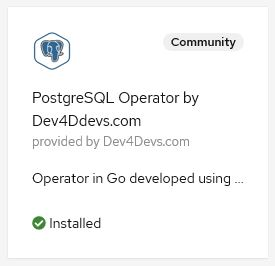
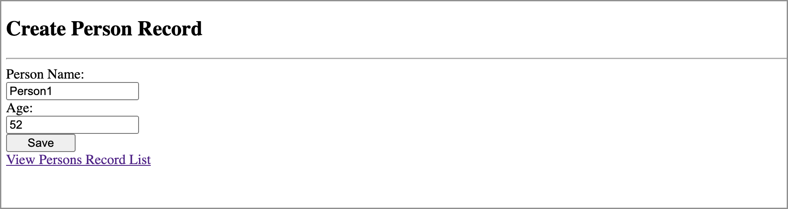
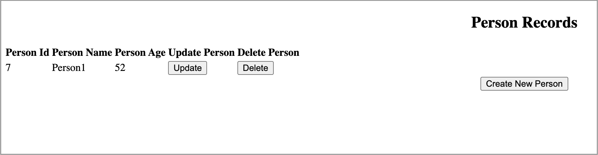

# Binding a Java Microservices JPA app to an In-cluster Operator Managed PostgreSQL Database

## Introduction

This scenario illustrates binding an odo managed Java MicroServices JPA application to an in-cluster operator managed PostgreSQL Database.

## What is odo?

odo is a CLI tool for creating applications on OpenShift and Kubernetes. odo allows developers to concentrate on creating applications without the need to administer a cluster itself. Creating deployment configurations, build configurations, service routes and other OpenShift or Kubernetes elements are all automated by odo.

Before proceeding, install the latest odo CLI (version 2.4.0+) by following the installation instructions outlined in the [odo](https://odo.dev) documentation.

## Actions to Perform by Users in 2 Roles

In this example there are 2 roles:

* Cluster Admin - Installs the operators to the cluster
* Application Developer - Imports a Java MicroServices JPA application, creates a DB instance, creates a request to bind the application and DB (to connect the DB and the application).

### Cluster Admin

The cluster admin needs to install the backing service operator into the cluster.

A backing service operator is an operator that represents a database or any other services required by the application. 
In order to bound to the application, it needs to expose binding information in secrets, config maps, status, and/or spec
attributes. We'll use Dev4Devs PostgreSQL Operator found in the OperatorHub to demonstrate a sample use case.

#### Installing the DB Operator

Before installing this operator, create the project/namespace under which the application will be deployed. This operator is namespace scoped, so it needs to be installed in the same namespace where the application will be deployed.

```shell
> odo project create service-binding-demo
```

Access your Openshift Console and install the Dev4Devs PostgreSQL Operator from the Operator Hub.



- NOTE: During the installation of this operator, be sure to pick the newly created `service-binding-demo` as the namespace in which to install it.


### Application Developer

#### Login to your cluster and clone the demo JPA microservice application

In this example we will use odo to manage a sample [JPA application](https://github.com/OpenLiberty/devfile-stack-samples/tree/main/jpa).

1. Log in to your OpenShift cluster with the `oc login` command and be sure that the current namespace is "service-binding-demo".

2. Clone the application repository.

```shell
git clone https://github.com/OpenLiberty/devfile-stack-samples.git && \
cd devfile-stack-samples/jpa
```

3. Create a Java Open Liberty component.

- If you want the application to be built and deployed using Maven:

```shell
odo create java-openliberty mysboproj
```

- If you want the application to be built and deployed using Gradle:

```shell
odo create java-openliberty-gradle mysboproj
```

4. Push the application to the cluster.

```shell
odo push 
```

You might see a delay or even something looking like an error message if the stack image needs to be pulled, so give it a bit of time.  Eventually you should see:

```
Pushing devfile component "mysboproj"
 ✓  Changes successfully pushed to component
```

5. The application is now deployed to the cluster - you can view the status of the cluster and the application test results by streaming the openshift logs to the terminal

```shell
odo log
```

Notice the failing tests due to an UnknownDatabaseHostException:

```shell
[err] Caused by: 
[err] java.net.UnknownHostException: ${DATABASE_CLUSTERIP}
[err] 	at java.base/java.net.AbstractPlainSocketImpl.connect(AbstractPlainSocketImpl.java:220)
[err] 	at java.base/java.net.SocksSocketImpl.connect(SocksSocketImpl.java:392)
[err] 	at java.base/java.net.Socket.connect(Socket.java:609)
[err] 	at org.postgresql.core.PGStream.createSocket(PGStream.java:231)
[err] 	at org.postgresql.core.PGStream.<init>(PGStream.java:95)
[err] 	at org.postgresql.core.v3.ConnectionFactoryImpl.tryConnect(ConnectionFactoryImpl.java:98)
[err] 	at org.postgresql.core.v3.ConnectionFactoryImpl.openConnectionImpl(ConnectionFactoryImpl.java:213)
[err] 	... 86 more
[ERROR] Tests run: 2, Failures: 1, Errors: 1, Skipped: 0, Time elapsed: 0.706 s <<< FAILURE! - in org.example.app.it.DatabaseIT
[ERROR] testGetAllPeople  Time elapsed: 0.33 s  <<< FAILURE!
org.opentest4j.AssertionFailedError: Expected at least 2 people to be registered, but there were only: [] ==> expected: <true> but was: <false>
        at org.example.app.it.DatabaseIT.testGetAllPeople(DatabaseIT.java:67)

[ERROR] testGetPerson  Time elapsed: 0.047 s  <<< ERROR!
java.lang.NullPointerException
        at org.example.app.it.DatabaseIT.testGetPerson(DatabaseIT.java:55)

[INFO]
[INFO] Results:
[INFO]
[ERROR] Failures:
[ERROR]   DatabaseIT.testGetAllPeople:57 Expected at least 2 people to be registered, but there were only: [] ==> expected: <true> but was: <false>
[ERROR] Errors:
[ERROR]   DatabaseIT.testGetPerson:41 NullPointer
[INFO]
[ERROR] Tests run: 2, Failures: 1, Errors: 1, Skipped: 0
[INFO]
[ERROR] Integration tests failed: There are test failures.
```

This issue occurs because the application, currently, does not have access to data needed to access the database. Moreover, the PostgreSQL database instance has not been created yet. This will be resolved by the next sequence of steps.

#### Creating a database to be used by the sample application

We can use the PostgreSQL Operator's default configuration to start a Postgres database, but since our application requires specific information about the database, lets make sure that information is properly populated in the database service we start.

1. Display the service providers and services available.

```shell
odo catalog list services
```

Output:

```shell
Services available through Operators
NAME                                CRDs
postgresql-operator.v0.1.1          Backup, Database
```

2. Generate the yaml config of the Database service provided by the postgresql-operator.v0.1.1 operator and store it in a file.

```shell
odo service create postgresql-operator.v0.1.1/Database --dry-run > db.yaml
```

3. Open db.yaml and do the following:

Customize the database name, user, and password values under the `spec:` section as shown:

```yaml
spec:
  databaseName: "sampledb"
  databasePassword: "samplepwd"
  databaseUser: "sampleuser"
```

Customize the resource instance name and add the needed annotations under the `metadata` section as shown:

```yaml
metadata:
  name: sampledatabase
  annotations:
    service.binding/db_name: 'path={.spec.databaseName}'
    service.binding/db_password: 'path={.spec.databasePassword}'
    service.binding/db_user: 'path={.spec.databaseUser}'
```

Adding the annotations ensures that odo will inject the `databaseName`, `databasePassword` and `databaseUser` spec values into the application. Note that the instance name you configure will be used as part of the name of various artifacts and resource references. Be sure to change it.

4. Generate the Database service devfile configuration.

```shell
odo service create --from-file db.yaml
```

5. Push the updates to the cluster.

```shell
odo push
```

This action creates a Dev4Ddevs Database resource instance, which in turn triggers the creation of a PostgreSQL database instance in the `service-binding-demo` namespace.

#### Binding the database and the application

The only thing that remains is to bind the PostgreSQL database data to the application.

1. List the available services to which the application can be bound. The PostgreSQL database service should be listed.

```shell
odo service list
NAME                        MANAGED BY ODO      STATE      AGE
Database/sampledatabase     Yes (mysboproj)     Pushed     50s
```

2. Generate the service binding devfile configuration.

```shell
odo link Database/sampledatabase
```

3. Push the updates to the cluster.

```shell
odo push
```

When the updates are pushed to the cluster, a secret containing the database connection information is created and the pod hosting the application is restarted. The new pod now contains the database connection information, from the mentioned secret, as environment variables.

- Inspecting the secret.

 You can do this via the Openshift console (Administrator view). Navigate to `Workloads > Secrets` and clicking on the secret named `mysboproj-database-sampledatabase`. Notice that it contains 4 pieces of data all related to the connection information for your PostgreSQL database instance.

- Inspecting the pod.

To see the newly set environment variables containing database connection information, issue the following command:

```shell
odo exec -- bash -c 'export | grep DATABASE'
```

Output:

```shell
declare -x DATABASE_CLUSTERIP="172.30.36.67"
declare -x DATABASE_DB_NAME="sampledb"
declare -x DATABASE_DB_PASSWORD="samplepwd"
declare -x DATABASE_DB_USER="sampleuser"
...
```

#### Running the Application

1. Find the URL to access the application through a browser.

```shell
odo url list
```

Output:

```shell
Found the following URLs for component mysboproj
NAME     STATE      URL                                                                      PORT     SECURE     KIND
ep1      Pushed     http://ep1-mysboproj-service-binding-demo.apps.my.os.cluster.ibm.com     9080     false      route
```

2. Open a browser and go to the URL shown by the previous step.

- Click `Create New Person` button. 


- Enter a user's name and age via the form shown on the page, and click the `Save`.



After you save the data to the postgreSQL database, notice that you are re-directed to the PersonList.xhtml page. The data being displayed is retrieved from the database.



You may inspect the database instance itself and query the table to see the data in place by using the **psql** command line tool. For that, navigate to the pod hosting the database instance from the OpenShift Console, click on the terminal tab, and issue the following commands:

- To access the sampledb database.

```shell
psql sampledb
```

Sample output:

```shell

sh-4.2$ psql sampledb
psql (9.6.10)
Type "help" for help.

sampledb=# 
```

- To query the database.

```shell
sampledb=# SELECT * FROM person;
```
Sample output:

```shell
 personid | age |  name   
----------+-----+---------
        7 |  52 | Person1
(1 row)

sampledb=# 
```
