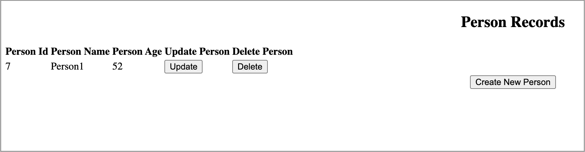

# Binding a Java Microservices JPA app to an In-cluster Operator Managed Db2 Database

## Introduction

This scenario illustrates binding an odo managed Java MicroServices JPA application to an operator managed Db2 Database.

## What is the Open Liberty Application Stack?
The [Open Liberty devfile stack](https://github.com/OpenLiberty/application-stack#open-liberty-application-stack) provides much of the infrastructure (Open Liberty, Maven/Gradle, Open J9, etc.) needed to start developing applications that use Maven or Gradle, and it is made available as Maven and Gradle development images. The devfiles that are provided by the stack use these images as a base to build and run your applications. 

The Open Liberty devfile stack provides two fully configured [devfiles](https://docs.devfile.io/devfile/2.1.0/user-guide/index.html): A [Maven-based devfile](https://github.com/devfile/registry/blob/main/stacks/java-openliberty/devfile.yaml) and a [Gradle-based devfile](https://github.com/devfile/registry/blob/main/stacks/java-openliberty-gradle/devfile.yaml). These devfiles define the environment and steps to build and deploy your application using the Open Liberty runtime.

## What is odo?

[Odo](https://odo.dev) is a simple CLI tool to create devfile-based components that interact directly with your Kubernetes cluster. With odo you can set up the environment, and also build, deploy, access, and debug your application. Directives to manage the environment and application are provided by a component's devfile.

## What is Service Binding Operator?

The [Service Binding Operator](https://github.com/redhat-developer/service-binding-operator/blob/master/README.md) makes it easier for developers to bind operator managed services (i.e. databases) to applications. More specifically, the operator will collect service data, deploy resources (i.e. secrets, configmaps) containing that data, and will make the data available to the application through the ServiceBinding custom resource it provides.


## Install the Operators.

### Install the Service Binding Operator

Navigate to the `Operators`->`OperatorHub` in the OpenShift console and in the `Developer Tools` category select the `Service Binding Operator` operator (version 0.9.1+)


### Install the Db2 operator

1. Create the project/namespace under which the application will be deployed. This operator is namespace scoped, so it needs to be installed in the same namespace where the application will be deployed. All work from this point forward will be done under 
this project/namespace.

```shell
odo project create service-binding-db2
```

2. Setup persistent Storage for Db2 persistent volume usage.

Follow these instructions to [create a storage class for NFS dynamic storage provisioning in an OpenShift environment](https://www.ibm.com/support/pages/how-do-i-create-storage-class-nfs-dynamic-storage-provisioning-openshift-environment)

3. Create a Db2 pull secret to pull Db2 images from cp.icr.io.

- [Log in to IBM](https://myibm.ibm.com/dashboard/). You will need to use your existing IBM ID or create for one.

- Under the `My IBM` tab, scroll down to `Products -> Software` section and click on `View library` under the `Container software library` tile.
- Click on `Get entitlement key` on the left panel and copy the entitlement key.
- Create a file called `db2CreatePullSecret.sh` and add the entries shown below. After updating it with the needed information, save the udpates.

```shell
ENTITLEDKEY="<Entitlement key you copied previously> "
EMAIL="<Email ID associated with your IBM ID>"
NAMESPACE="<Project/namespace previously created>"
 
oc create secret docker-registry ibm-registry   \
    --docker-server=cp.icr.io                   \
    --docker-username=cp                        \
    --docker-password=${ENTITLEDKEY}            \
    --docker-email=${EMAIL}                     \
    --namespace=${NAMESPACE}
```

Run the db2CreatePullSecret.sh script to create the `ibm-registry` secret.

```shell
chmod 755 db2CreatePullSecret.sh && \ 
./db2CreatePullSecret.sh
```

Validate that the secret was created.

```shell
oc get secret ibm-registry -n service-binding-db2
```

Output:

```shell
NAME           TYPE                             DATA   AGE
ibm-registry   kubernetes.io/dockerconfigjson   1      1h
```

4. Enable the IBM operator catalog to access the IBM Db2 operator.

Create a file called `ibm-o-catalog-intall.yaml` and add the following CatalogSource config:

```shell
apiVersion: operators.coreos.com/v1alpha1
kind: CatalogSource
metadata:
  name: ibm-operator-catalog
  namespace: openshift-marketplace
spec:
  displayName: "IBM Operator Catalog"
  publisher: IBM
  sourceType: grpc
  image: docker.io/ibmcom/ibm-operator-catalog
  updateStrategy:
    registryPoll:
      interval: 45m
```

Apply the CatalogSource config to your cluster.

```shell
oc apply -f ibm-o-catalog-intall.yaml:
```

Verify the installation by running this command:

```shell
oc get CatalogSources ibm-operator-catalog -n openshift-marketplace
```

If the installation was successful, you should see output that is similar to this:

```
NAME                   DISPLAY                TYPE   PUBLISHER   AGE
ibm-operator-catalog   IBM Operator Catalog   grpc   IBM         1h
```

5. Install the `IBM Db2` operator from the IBM operator catalog.

Navigate to the `Operators`->`OperatorHub` in the OpenShift console. Select the `Database` category and search for the `IBM Db2` operator provided by IBM.


When installing the operator, be sure to pick the `service-binding-db2` namespace we created previously.

## Create a Java Open Liberty based component and the Database resource service

1. Clone the application repository.

```shell
git clone https://github.com/OpenLiberty/application-stack-samples.git && \
cd application-stack-samples/jpa
```

2. Create a Java Open Liberty component.

For this step you can either use gradle or maven to build and deploy your application.

To use Maven:

```shell
odo create mysboproj --devfile ./assets/devfiles/maven/db2-usage-activation.yaml
```

To use Gradle:

```shell
odo create mysboproj --devfile ./assets/devfiles/gradle/db2-usage-activation.yaml
```

3. Display the service providers and services available in the cluster.

```shell
odo catalog list services
```

Output:

```shell
Services available through Operators
NAME                                CRDs
db2u-operator.v1.1.4                BigSQL, Db2uCluster, Db2uHadr, Db2uHelmMigration, FormationLock, Formation
...
```

4. Generate the `db2u-operator.v1.1.4` provided Db2uCluster resource/service configuration and store it in a file. The data is stored in a file because some entries such as the resource name, the access information, and annotations will be customized.

```shell
odo service create db2u-operator.v1.1.4/Db2uCluster --dry-run > db2Cluster.yaml
```

5. Customize `db2Cluster.yaml`.

Add the following under the spec section:

```yaml
spec:
  account:
    imagePullSecrets:
     - ibm-registry
    privileged: true
  environment:
    dbType: db2oltp
    database:
      name: bludb
    instance:
      user: db2inst1
      password: db2inst1pwd
    ldap:
      enabled: false
  license:
    accept: true
```

Add the needed annotations and customize the resource instance name to match the following:

```yaml
metadata:
  name: sampledb2database
  annotations:
    service.binding/db_name: 'path={.spec.environment.database.name}'
    service.binding/db_user: 'path={.spec.environment.instance.user}'
```

The annotations are used to inform the Service Binding Operator about the service data required by the application.
The instance name you use will be used as part of the name of various artifacts and for resource references. Be sure to
change it.

6. Generate the Db2uCluster service config.

```shell
odo service create --from-file db2Cluster.yaml
```

The generated Db2uCluster resource config in `devfile.yaml` should look like this:

```yaml
- kubernetes:
    inlined: |
      apiVersion: db2u.databases.ibm.com/v1
      kind: Db2uCluster
      metadata:
        annotations:
          service.binding/db_name: path={.spec.environment.database.name}
          service.binding/db_user: path={.spec.environment.instance.user}
        labels:
          app.kubernetes.io/instance: db2u-operator
          app.kubernetes.io/managed-by: Db2U-Team
          app.kubernetes.io/name: db2u-operator
        name: sampledb2database
      spec:
        account:
          imagePullSecrets:
          - ibm-registry
          privileged: true
        environment:
          database:
            name: bludb
          dbType: db2oltp
          instance:
            password: db2inst1pwd
            user: db2inst1
          ldap:
            enabled: false
        license:
          accept: true
        size: 1
        storage:
        - name: share
          spec:
            accessModes:
            - ReadWriteMany
            resources:
              requests:
                storage: 100Gi
            storageClassName: managed-nfs-storage
          type: create
        version: 11.5.6.0-cn1
  name: sampledb2database
```

7. Push the updates to the cluster.

```shell
odo push
```

This action creates a Db2uCluster resource instance, which in turn triggers the creation of a Db2 database instance in the service-binding-db2 namespace.

Wait until the `c-sampledb2database-restore-morph-*` pod has a status of `completed`. This will take a few minutes.

Use the following command to see the status of the db2 pods:

```shell
oc get pods -n service-binding-db2 --selector app=sampledb2database
```

Once the Db2uCluster service was created successfully, you should see output that is similar to this:

```shell
NAME                                      READY   STATUS      RESTARTS   AGE
c-sampledb2database-db2u-0                1/1     Running     0          116s
c-sampledb2database-etcd-0                1/1     Running     0          2m26s
c-sampledb2database-instdb-cwl2c          0/1     Completed   0          2m46s
c-sampledb2database-restore-morph-2s29s   0/1     Completed   0          85s
```

## Binding the database and the application

The only thing that remains is to bind the Db2 database data to the application.

1. List the available services to which the application can be bound. The Db2 database service should be listed.

```shell
odo service list
```

Ouput:

```shell
NAME                                                       MANAGED BY ODO      STATE          AGE
Db2uCluster/sampledb2database                              Yes (mysboproj)     Pushed         4m58s
...
```

2. Generate the ServiceBinding resource devfile configuration .

```shell
odo link Db2uCluster/sampledb2database
```

3. Update the generated ServiceBinding resource config in `devfile.yaml`.

Db2 stores the user's password in a secret with a well defined name: `c-<DB2UCLUSTER_NAME>-instancepassword` (`c-sampledb2database-instancepassword`).

Provide the ServiceBinding resource with the name of the secret containing the password by adding a service entry under the ServiceBinding resource config in `devfile.yaml`:

```yaml
- kubernetes:
      ...
      kind: ServiceBinding
      ...
      spec:
        ...
        services:
        ...
        - group: ""
          kind: Secret
          name: c-sampledb2database-instancepassword
          version: v1
```

After the update, the ServiceBinding resource config in `devfile.yaml` should look like this:

```yaml
- kubernetes:
    inlined: |
      apiVersion: binding.operators.coreos.com/v1alpha1
      kind: ServiceBinding
      metadata:
        creationTimestamp: null
        name: mysboproj-db2ucluster-sampledb2database
      spec:
        application:
          group: apps
          name: mysboproj-app
          resource: deployments
          version: v1
        bindAsFiles: false
        detectBindingResources: true
        services:
        - group: db2u.databases.ibm.com
          kind: Db2uCluster
          name: sampledb2database
          version: v1
        - group: ""
          kind: Secret
          name: c-sampledb2database-instancepassword
          version: v1
      status:
        secret: ""
  name: mysboproj-db2ucluster-sampledb2database
```

4. Push the updates to the cluster.

```shell
odo push
```

When the updates are pushed to the cluster, a secret containing the database connection information is created and the pod hosting the application is restarted. The new pod now contains the database connection information, from the mentioned secret, as environment variables.

You can inspect the mentioned secret via the Openshift console (Administrator view). Navigate to `Workloads > Secrets` and clicking on the secret named `mysboproj-db2ucluster-sampledb2database-...`. Notice that it contains 3 pieces of data to access your Db2 database instance.

You can also inspect the pod to see the newly set environment variables containing database access information. Issue the following command:

```shell
odo exec -- bash -c 'env | grep -e DB2UCLUSTER -e SECRET'
```

Output:

```shell
SECRET_PASSWORD=db2inst1pwd
DB2UCLUSTER_DB_NAME=bludb
DB2UCLUSTER_DB_USER=db2inst1
```

## Running the Application

1. Find the URL to access the application through a browser.

```shell
odo url list
```

Output:

```shell
Found the following URLs for component mysboproj
NAME     STATE      URL                                                                      PORT     SECURE     KIND
ep1      Pushed     http://ep1-mysboproj-service-binding-demo.apps.my.os.cluster.ibm.com     9080     false      route
```

2. Open a browser and go to the URL shown by the execution of the last command.

- Click `Create New Person` button. 


- Enter a user's name and age via the form shown on the page, and click the `Save`.


After you save the data to the postgreSQL database, notice that you are re-directed to the PersonList.xhtml page. The data being displayed is retrieved from the database.

